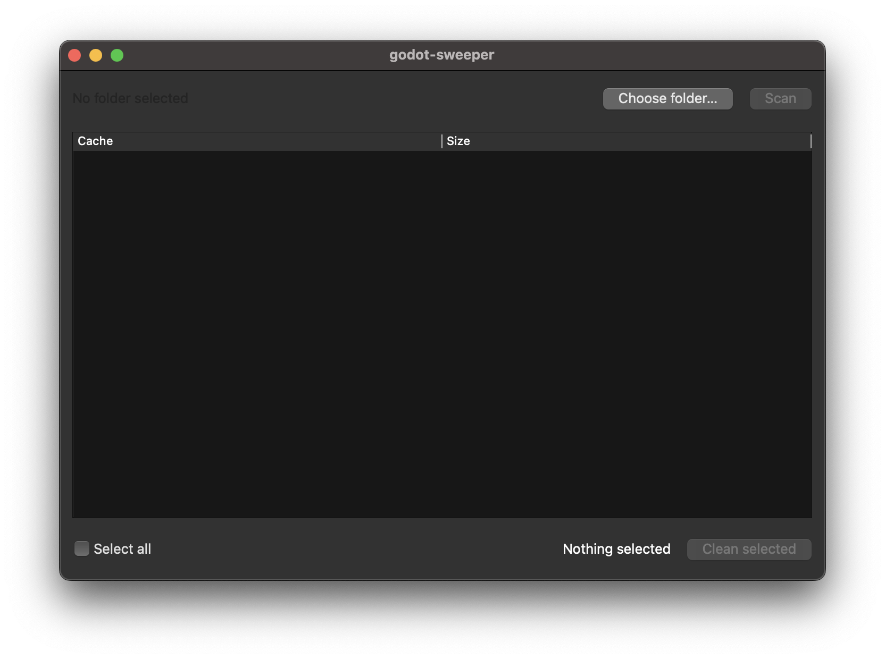

# godot-sweeper

Clean Godot's `.godot/` cache without nuking your project by accident.

When you work in Godot, the `.godot/` folder fills up with imported-asset
cache and compiled shader cache. It gets big, and once in a while it
corrupts and gives you weird bugs that vanish the moment you delete it.
This is a small GUI that scans for that cache, shows you what's there,
and lets you clear it on purpose.



## what it does

- finds every Godot project (`project.godot`) under a folder you pick
- lists the safe-to-delete cache in each one, with sizes
- you tick what you want gone, see the total, hit clean
- Godot rebuilds the cache next time you open the project

## what it will never do

Deleting files is the scary part, so the rules are strict and live in
`core.py`, not in the UI:

- it only ever touches things **inside** a `.godot/` directory
- it works off an **allowlist** (`imported`, `shader_cache`, `editor`) —
  anything it doesn't recognise is left alone
- it never deletes `project.godot` or any of your source files
- every path is re-checked against a safety gate immediately before delete,
  so a UI bug can't make it delete the wrong thing
- nothing happens without an explicit click and a confirm dialog

There's a test (`test_core.py`) whose whole job is to prove a source file
survives and that the gate blocks deletes outside `.godot/`.

## run it

```bash
python3 -m venv .venv
source .venv/bin/activate        # windows: .venv\Scripts\activate
pip install -r requirements.txt

python -m godot_sweeper
```

## run the tests

```bash
python test_core.py
# -> ALL TESTS PASSED
```

## stack

- Python 3.10+ (uses `X | Y` type syntax)
- PySide6 for the GUI
- standard library for everything that touches the filesystem

## roadmap

- [ ] remember last-scanned folder
- [ ] show cache age (warn before deleting a fresh one mid-session)
- [ ] `--dry-run` CLI mode for the terminal people
- [ ] optional: clean `.import/` left over from Godot 3 projects

---

half baked studios — if it deletes your homework, that's a bug, open an issue.
